# MCGEE - Multiagent Code-generator for Google Earth Engine 🛰️

A multi-agent LLM APP that generates Google Earth Engine code for given a research objective, date/time, lat/long, and any specific methodology. Strictly uses Gemini 3 Pro, made for GEMINI 3 Hackathon.

MCGEE is a MVP project, with the objective to leverage multiple agents and their deep research capabilities and code writing capabilities of LLMs to make remote sensing code generation accessible to everyone.


---

## 🎬 Demo Video

| Example | Step | Video |
|---------|------|-------|
| Setup | Initialization | <a href="https://youtu.be/_hWtLnabNxg?t=0" target="_blank"></a> |
| **Floods in Pakistan** | Thinking | <a href="https://youtu.be/_hWtLnabNxg?t=12" target="_blank"></a> |
| | Sources | <a href="https://youtu.be/_hWtLnabNxg?t=41" target="_blank"></a> |
| | Thought Logs | <a href="https://youtu.be/_hWtLnabNxg?t=64" target="_blank"></a> |
| | Pasting Code | <a href="https://youtu.be/_hWtLnabNxg?t=71" target="_blank"></a> |
| **Mining Detection in Peru** | Thinking | <a href="https://youtu.be/_hWtLnabNxg?t=102" target="_blank"></a> |
| | Sources | <a href="https://youtu.be/_hWtLnabNxg?t=130" target="_blank"></a> |
| | Pasting Code | <a href="https://youtu.be/_hWtLnabNxg?t=155" target="_blank"></a> |
| **Urban Heat Island - Tokyo** | Thinking | <a href="https://youtu.be/_hWtLnabNxg?t=211" target="_blank"></a> |
| | Refining Code | <a href="https://youtu.be/_hWtLnabNxg?t=227" target="_blank"></a> |
| | Pasting Code | <a href="https://youtu.be/_hWtLnabNxg?t=279" target="_blank"></a> |

**▶️ [Watch Full Demo on YouTube](https://www.youtube.com/watch?v=_hWtLnabNxg)**

---

## What It Does


**The agents:**
- � **Planner** - Breaks your question into steps
- 🔬 **Researcher** - Finds the best satellites and methods
- 💻 **Coder** - Writes the Earth Engine script
- 📝 **Synthesizer** - Explains what it did

You can watch them think in real-time!

---

## Quick Start

### 1. Get Your API Key
You need a [Google AI API key](https://aistudio.google.com/app/apikey) (free).

### 2. Setup

```bash
# Copy the example file
cp .env.example .env

# Add your API key to .env
GOOGLE_API_KEY=your-key-here
```

### 3. Install

```bash
# Python packages
pip install -r requirements.txt

# Frontend packages
cd app && npm install
```

### 4. Run

```bash
./start.sh
```

Open http://localhost:3000

---

## How It Works

```mermaid
graph TB
    User[🧑 You Type a Question] --> Chat[💬 Chat Agent]
    
    Chat --> Orch[🎯 Orchestrator]
    
    Orch --> Plan[📋 Planner<br/>Breaks into tasks]
    Orch --> Research[🔬 Researcher<br/>Finds data & methods]
    Orch --> Code[💻 Coder<br/>Writes the script]
    Orch --> Synth[📝 Synthesizer<br/>Explains the approach]
    
    Plan -.->|thoughts| WS[📡 WebSocket]
    Research -.->|thoughts| WS
    Code -.->|thoughts| WS
    Synth -.->|thoughts| WS
    
    WS --> UI[🖥️ Your Browser]
    
    Code --> Result[✅ Earth Engine Script]
    
    style User fill:#3b82f6,color:#fff
    style Result fill:#10b981,color:#fff
    style WS fill:#8b5cf6,color:#fff
```



All agents stream their thoughts live so you can see the reasoning.

---

## Example Questions

Try these:

- "Analyze Amazon deforestation from 2020-2023"
- "Show California wildfire burn scars"
- "Detect floods in Bangladesh using radar"
- "Track urban growth in Tokyo"
- "Calculate NDVI for farms in Iowa"

---

## Tech Stack

| Part | Tech |
|------|------|
| **Agents** | Google Gemini 3 Pro |
| **Backend** | Python + FastAPI |
| **Frontend** | Next.js + TypeScript |
| **Streaming** | WebSocket |
| **Target** | Google Earth Engine |

---

## Project Structure

```
orbital-insight/
├── agents/          # The 4 AI agents
├── api/             # FastAPI backend
├── app/             # Next.js frontend
└── start.sh         # Run everything
```

---


## License

MIT
